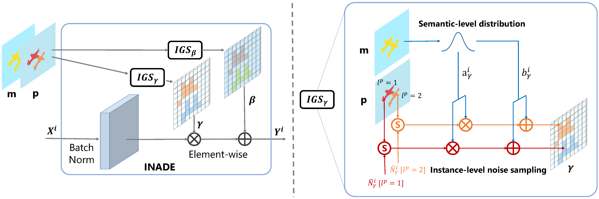

# Diverse Semantic Image Synthesis via Probability Distribution Modeling (CVPR 2021)

### [Paper](https://openaccess.thecvf.com/content/CVPR2021/papers/Tan_Diverse_Semantic_Image_Synthesis_via_Probability_Distribution_Modeling_CVPR_2021_paper.pdf)

[Zhentao Tan](https://scholar.google.com/citations?user=VCX7itEAAAAJ&hl=zh-CN&oi=ao), [Menglei Chai](https://mlchai.com/), [Dongdong Chen](http://www.dongdongchen.bid/), [Jing Liao](https://liaojing.github.io/html/index.html), [Qi Chu](https://scholar.google.com/citations?user=JZjOMdsAAAAJ&hl=en), [Bin Liu], [Gang Hua](https://scholar.google.com/citations?user=7SgUlggAAAAJ&hl=zh-CN&oi=ao), [Nenghai Yu](https://scholar.google.com/citations?user=7620QAMAAAAJ&hl=zh-CN)

## Abstract
Semantic image synthesis, translating semantic layouts to photo-realistic images, is a one-to-many mapping problem. Though impressive progress has been recently made, diverse semantic synthesis that can efficiently produce semantic-level multimodal results, still remains a challenge. In this paper, we propose a novel diverse semantic image synthesis framework from the perspective of semantic class distributions, which naturally supports diverse generation at semantic or even instance level. We achieve this by modeling class-level conditional modulation parameters as continuous probability distributions instead of discrete values, and sampling per-instance modulation parameters through instance-adaptive stochastic sampling that is consistent across the network. Moreover, we propose
prior noise remapping, through linear perturbation parameters encoded from paired references, to facilitate supervised training and exemplar-based instance style control at test time. Extensive experiments on multiple datasets show that our method can achieve superior diversity and comparable quality compared to state-of-the-art methods.

## Installation

Clone this repo.
```bash
git clone https://github.com/tzt101/INADE.git
cd INADE/
```

This code requires PyTorch 1.6 and python 3+. Please install dependencies by
```bash
pip install -r requirements.txt
```

## Dataset Preparation
The Cityscapes and ADE20K dataset can be downloaded and prepared following [SPADE](https://github.com/NVlabs/SPADE.git). The CelebAMask-HQ can be downloaded from [CelebAMask-HQ](https://github.com/switchablenorms/CelebAMask-HQ), you need to to integrate the separated annotations into an image file (the format like other datasets, e.g. Cityscapes and ADE20K). The DeepFashion can be downloaded from [SMIS](https://github.com/Seanseattle/SMIS), and the version with two persons can be downloaded from [OneDrive](). 

To make or reid the instance map, you can use the following commands:
```bash
python make_instances.py --path [Path_to_dataset] --dataset [ade20k | cityscapes | celeba | deepfashion]
```

## Generating Images Using Pretrained Model

Once the dataset is ready, the result images can be generated using pretrained models.

1. Download the pretrained models from the [OneDrive](), save it in `checkpoints/`. The structure is as follows:
```bash
./checkpoints/
    inade_ade20k/
        best_net_G.pth
        best_net_IE.pth
    inade_celeba/
        best_net_G.pth
        best_net_IE.pth
    inade_cityscapes/
        best_net_G.pth
        best_net_IE.pth
    inade_deepfashion/
        best_net_G.pth
        best_net_IE.pth
```
The `noise_nc` is 64 for all pretrained models except which on deepfashion (set to 8). Because we find that it's enough for quality and diversity.

2. Generate the images on the test dataset.
```bash
python test.py --name [model_name] --norm_mode inade --batchSize 1 --gpu_ids 0 --which_epoch best --dataset_mode [dataset] --dataroot [Path_to_dataset]
```
`[model_name]` is the directory name of the checkpoint file downloaded in Step 1, such as `inade_ade20k` and `inade_cityscapes`. `[dataset]` can be on of `ade20k`, `celeba`, `cityscapes` and `deepfashion`. `[Path_to_dataset]` is the path to the dataset. If you want to use encoder, you can add the another option `--use_vae`.

## Training New Models

You can train your own model with the following command:
```bash
# To train CLADE and CLADE-ICPE.
python train.py --name [experiment_name] --dataset_mode [dataset] --norm_mode inade --use_vae --dataroot [Path_to_dataset]
```
If you want to test the model during the training step, please set `--train_eval`. By default, the model every 10 epoch will be test in terms of FID. Finally, the model with best FID score will be saved as `best_net_G.pth`.

## Calculate FID 

We provide the code to calculate the FID which is based on [rpo](https://github.com/mseitzer/pytorch-fid.git). We have pre-calculated the distribution of real images (all images are resized to 256×256 except cityscapes is 512×256) in `training` set of each dataset and saved them in `./datasets/train_mu_si/`. You can run the following command:
```bash
python fid_score.py [Path_to_real_image] [Path_to_fake_image] --batch-size 1 --gpu 0 --load_np_name [dataset] --resize_size [Size]
```
The provided `[dataset]` are: `ade20k`, `celeba`, `cityscapes`, `coco` and `deepfashion`. You can save the new dataset by replacing `--load_np_name [dataset]` with `--save_np_name [dataset]`.

## New Useful Options 

The new options are as follows:
- `--use_amp`: if specified, use AMP training mode.
- `--train_eval`: if sepcified, evaluate the model during training.
- `--eval_dims`: the default setting is 2048, Dimensionality of Inception features to use.
- `--eval_epoch_freq`: the default setting is 10, frequency of calculate fid score at the end of epochs.

## Code Structure

- `train.py`, `test.py`: the entry point for training and testing.
- `trainers/pix2pix_trainer.py`: harnesses and reports the progress of training.
- `models/pix2pix_model.py`: creates the networks, and compute the losses
- `models/networks/`: defines the architecture of all models
- `options/`: creates option lists using `argparse` package. More individuals are dynamically added in other files as well. Please see the section below.
- `data/`: defines the class for loading images and label maps.

## Citation
If you use this code for your research, please cite our papers.
```
@inproceedings{tan2021diverse,
  title={Diverse Semantic Image Synthesis via Probability Distribution Modeling},
  author={Tan, Zhentao and Chai, Menglei and Chen, Dongdong and Liao, Jing and Chu, Qi and Liu, Bin and Hua, Gang and Yu, Nenghai},
  booktitle={Proceedings of the IEEE/CVF Conference on Computer Vision and Pattern Recognition},
  pages={7962--7971},
  year={2021}
}
```

## Acknowledgments
This code borrows heavily from [SPADE](https://github.com/NVlabs/SPADE.git). 

